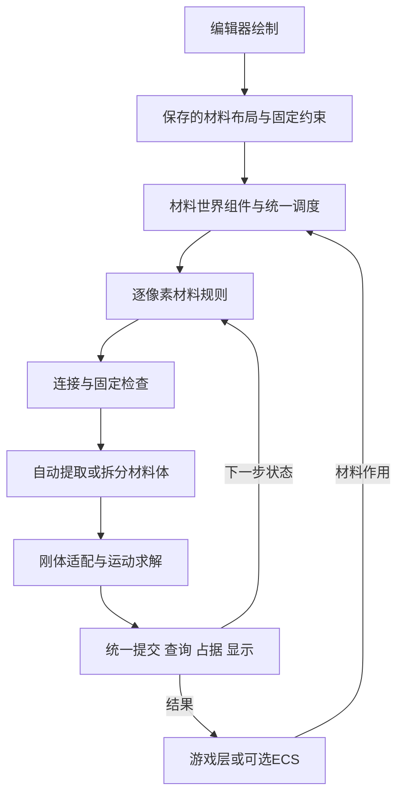

# OpenOita 技术初案 评审稿

2026年10月6日水汽交互设计修订：本稿相关条款同步为公共合同1.10及[M06-F01](specs/M06-F01-水汽暂存与恢复.md)。暂存/恢复已通过本轮Editor功能验证，见[本轮记录](validation/M06-F01-实现与验证.md)；历史仓库核对、估时和测试记录不据此变成当前完成证据。JSON格式、默认值和性能阈值保持不变。

更新：2026年10月6日（北京时间）｜版本：0.10｜状态：首版技术设计基线；默认参数已给出，代码、构建与性能待实现验证

本轮以“可绘制的材料世界组件＋自动结构处理”为首版目标，替换0.4版的受限动态体交付边界。旧V0网格阶段和预置体释放仅作内部里程碑，不代表首版完成。0.9版将未细化的实现问题收束为可实施的技术基线和可调默认；它们是工程选择，不表示已经实测，也不表示每个数值都由用户逐项确认。默认按本稿实现和验证，不再等待额外的整套策划规则表。

关联文档：[交付方案](<D:/work/Project/OpenOita/docs/OpenOita 物理模拟交付方案 草案.md>)、[实现方案](<D:/work/Project/OpenOita/docs/OpenOita 初步实现方案 草案.md>)、[仓库核对与估时](<D:/work/Project/OpenOita/docs/OpenOita 仓库核对与模块估时 评审稿.md>)。

## 首版目标

首版必须在同一场景跑通：

**绘制并保存场景 → 材料改变 → 连接与固定检查 → 自动提取或拆分 → 物理运动。**

- 输入整个场景的材料布局与固定约束，不预先登记木板或将脱落的碎块。
- 外部只提交材料作用；系统处理全部符合规则的断开部分，不依赖脚本逐次判断、指定和释放物体。
- 动态材料体仍可逐格破坏；切断后自动拆成独立部分，继续平移、旋转和碰撞。
- 交付Unity组件和绘制工具，策划无需编写脚本即可布置场景。

允许缩小探针场景，先用直接移除或替换验证破坏；首版材料清单按下节执行，不能用探针子集替代完整交付。弯曲、弹性形变、应力传播及承载过载断裂不在目标内。复杂流体耦合、浮力、角色推挤、公开爆炸冲量接口和大世界优化另列范围；角色控制、伤害、AI、寻路等由游戏负责。

### 基础材料

2026年10月4日确认的首版材料清单如下。每格保存一个基础材料ID。

| ID | 材料 | 类型 |
| --- | --- | --- |
| 101 | 水 | 液体 |
| 102 | 混凝土 | 固体 |
| 103 | 蒸汽 | 气体 |
| 104 | 木头 | 固体 |

石头和沙不属于首版交付材料；仓库旧原型样例保留。

### 材料规则

规则单独定义，并关联适用材料。燃烧属于规则。

| 规则 | 适用材料 | 首版行为 | 依据 |
| --- | --- | --- | --- |
| 燃烧 | 木头等可燃材料；水参与灭火 | 可点燃、传播、烧损，遇水熄灭，燃尽消失；无烟、灰和耗氧 | 已确认，纳入首版 |
| 液体运动 | 水 | 每2 Tick先尝试净向下原子水链，余下源下落/斜下/有效横移，每实例最多一邻格；链内目标允许同链下一源，尾格须原空；开放槽摊平、平台溢流、停止无效往返，无压力和浮力 | 详见[M03-L01](specs/M03-L01-液体扩散与液面平衡.md)，新增验收待完成 |
| 气体运动与消散 | 蒸汽 | 初态或Spawn产生；每3 Tick候选上、斜上、横向一格；每Tick寿命减1，默认200 Tick后消散 | 本轮工程默认，可调参数 |
| 连接、固定与破坏 | 混凝土、木头 | 四邻接且connectionGroup相同则连接；building组允许两种材料连接；失固提取和断开拆分 | 本轮已选技术基线 |
| 相变及其他相互作用 | 水、蒸汽、混凝土、木头 | 水不被灭火消耗、不产生蒸汽；水与蒸汽不交换位置、互相阻挡；无蒸发、冷凝和自发热转化 | 首版明确排除，后续新增需求另评估 |

点燃入口为Ignite命令和初态initialBurning。木头默认fuelTicks=250，已燃烧格每Tick扣1燃料，每10个燃烧更新Tick向四面接触的可燃格提出点燃；新点燃格从下一Tick开始消耗和传播。水接触优先于本步点燃、传播和烧损；灭火只清除Burning，保留剩余燃料，可再次点燃，燃尽格不重生。水斜下及蒸汽左右平局按(tick+x+y+seed)奇偶选择；水横向须按M03-L01向可达低处扩散，不能仅因奇偶往返。无烟、灰包括不生成相应材料或视觉效果；不模拟氧气或氧气消耗。

全部材料由单个materials.json加载，根为schemaVersion=1、materialSetId=openoita-core-v1和materials数组。kind仅分类，tags显式启用规则；v1中solid必须绑定structure、liquid必须绑定liquid_flow、gas必须绑定gas_drift。规则ID固定为1 structure、2 liquid_flow、3 gas_drift、4 burnable、5 extinguishes_fire，ulong掩码位为RuleId-1；字符串只在加载时转换，Tick不查标签字符串。未知标签、错配、重复ID和非法参数整份拒绝。材料格只保存MaterialId和动态状态，共享属性及规则参数存材料运行表；完整格式见[材料样例](<D:/work/Project/OpenOita/docs/examples/materials.json>)及[材料Schema](<D:/work/Project/OpenOita/docs/schemas/materials.schema.json>)。

### 规则执行状态与显示

材料格保存规则需要的动态状态，包括燃烧标记、剩余燃料、传播计时与蒸汽寿命。木头燃尽前保留原材料ID、完整格几何及单格质量，已耗比例用于烧损显示；燃尽后移除该格、位置变空。燃尽移除进入统一事务，触发连接、固定、拆分、碰撞和质量更新；不在每次燃料递减时缩小几何或重新计算质量。

火焰是燃烧状态派生的附着视觉效果，不占材料格，不产生独立质量或碰撞。状态随材料搬运、提取和拆分，效果跟随当前归属与位姿。遇水熄灭时停止当前燃烧及烧损、撤销火焰；燃尽、移除、替换或Reset时同步清理或重置状态与效果。

查询与显示消费同一提交版本，仅状态变化也须刷新显示。initialBurning只能引用布局中有剩余燃料的可燃格；火焰使用随材料局部网格和位姿更新的附着显示，不生成独立物理对象。

## 架构与职责

保留CPU单线程材料基线、GPU显示和可替换的Unity 2D适配；Core与Simulation不直接调用Unity物理API。对象层ECS是可选玩法接入方式，不是物理结构形成的前提，也不要求首版迁移Unity Entities。

| 模块 | 职责 |
| --- | --- |
| 材料世界组件 | 绑定配置和布局，管理世界资源、生命周期及唯一时钟 |
| 编辑器绘制工具 | 材料选择、绘制、擦除、固定标记、初燃标记、预览和保存 |
| 材料内核 | 保存主网格与体内逐格状态，执行已支持的材料作用和规则 |
| 结构系统 | 检查连接与固定关系，识别所有分量，自动提取和再拆分 |
| 刚体适配器 | 根据材料生成碰撞及质量属性，计算整体运动，返回位姿与接触 |
| 查询与显示 | 消费同一提交版本，提供世界查询、占据映射和画面 |
| 游戏层 | 提交作用、读取事件并处理玩法；不直接改材料数组或刚体位姿 |

Noita的分享可作为像素与刚体结合的参考。本项目首版选择局部网格贪心矩形合并生成碰撞，不采用轮廓简化或三角剖分；实现仍须用孔洞、凹形和细连接探针验证。

## 可绘制组件

本轮选择Unity编辑器自定义Scene画笔；“像Tilemap”指操作体验，底层不使用Tilemap作为材料事实源。运行时画笔不进入首版。

策划添加组件、选择材料后即可画或擦材料，另行标记固定点或固定区域，并为可燃格设置或清除初燃标记。笔画仅改变材料布局，不创建物体身份；多笔可形成同一结构，一笔也可在破坏后分成多个体。

布局须保存并可重开编辑。进入运行时从保存数据建立副本，退出试玩不回写破坏结果；Reset恢复指定初态。初次进入运行也执行结构检查，无固定连接的结构按规则进入动态模拟。编辑器代码与运行时代码分离，独立PC包无需UnityEditor。

首版工具基线为材料选择、画笔、擦除、固定标记、初燃标记、预览和保存加载；撤销重做、填充、图案笔刷和图片导入不进入当前基线，新增时另评估。地图只保存编辑初态：版本、materialSetId、cells[{x,y,materialId}]、fixedCells和initialBurning，不保存运行BodyId；绑定材料集不匹配、引用不存在的材料或非法锚点时拒绝加载。材料表与布局分开保存，运行副本不回写编辑文件。样例见[world_config.json](<D:/work/Project/OpenOita/docs/examples/world_config.json>)和[scene.json](<D:/work/Project/OpenOita/docs/examples/scene.json>)，各有对应Schema。

## 状态与所有权

| 数据 | 内容 |
| --- | --- |
| 材料定义 | 共享ID、颜色、运动类别和已支持物性；固定状态不放在重力倍率中 |
| 初始布局 | 材料格、固定约束、初燃标记及布局版本；不保存预先划定的脱落对象 |
| 单格状态 | 一个基础材料ID、燃烧标记、剩余燃料和传播计时、蒸汽寿命及适用运动状态；搬运时整体保留 |
| 结构连接 | 根据材料与连接规则建立的关系，以及与固定约束的关联 |
| 动态材料体 | BodyId、局部材料、几何原点、提交位姿、速度和几何版本 |
| 派生表示 | 碰撞形状、世界占据与空间索引、渲染缓存 |
| 变化结果 | generation、committedTick、材料/几何变化和旧新BodyId映射 |

非空材料只能归主网格、一个材料体或一条M02水汽暂存记录所有；数量与容量按三者合计。准备副本不可查询，不计入材料总量；碰撞、占据和显示均由权威材料派生。现有双份MaterialId改为单一事实源和渲染缓存。

动态体保留局部材料及连续位姿，主网格保持轴对齐。允许将运动体映射为世界占据或命中引用；禁止把旋转采样结果反复覆盖权威材料，造成复制、漏失或累积失真。材料体内部固体保持刚性，不执行逐格落沙位移。

无生成、移除或转化时，搬运、提取与拆分前后逐材料数量守恒；消耗和产物需有记录。BodyId在同一generation内不复用。真正拆分时旧ID失效并返回新ID列表；仅改形状而仍为一个体时可保留ID。

### 坐标

采用X向右、Y向上，格中心为O+s×(x+0.5,y+0.5)，范围为[0,width)×[0,height)。默认格长s=0.1、世界256×256格、区块128×128格。点转格向下取整，空与越界分别返回。Host旋转为0、缩放为1，运行中原点不变。

2026年10月5日补齐像素语义：一个逻辑像素就是一个模拟格、一份独立材料状态和一个原始材料纹素；128×128区块仅分组存储，碰撞合并及刚体归组也保留逐像素状态。width/height决定逻辑分辨率，cellSize决定世界长度，显示倍率单独控制。标准材料预览默认1:1并提供显式整数倍放大，网格线默认关闭；窗口缩放不改变状态数量。动态体继续使用连续位姿，不为屏幕对齐修改物理。详细约定见[实现方案5.3](<OpenOita 初步实现方案 草案.md#53-像素粒度与显示约定>)和[公共合同C01](specs/CONTRACTS.md#c01-数据与坐标)；独立模块预览整改及M00–M05回归已完成本轮Editor验证，范围与待验项见[整改记录](validation/像素粒度-整改与验证.md)。

局部格经材料体位姿变换到世界，世界命中逆变换到局部后检查实际材料。质心与几何原点分别记录。包围盒只筛选候选，不能把凹形缺口或孔洞当作材料。

## 结构检查与拆分

首版采用全量连通检查，结构格只有四邻接且connectionGroup一致才连接，对角不连接。木头、混凝土均为building组，可异材连接。主网格新增或替换后按同一条件与相邻主网格材料连接；不同Body及Body与主网格之间不会因接触而焊接。检查包括跨区块路径，不能只看被破坏格的近邻就判定整块失去固定。

1. 初始化或材料改变后，按有效连接找出全部结构分量。
2. 仍连接有效固定点的分量保留固定；失去固定连接的分量进入脱落处理。
3. 对已有动态体检查剩余材料：一个分量更新形状，多个分量分别处理，空体撤销。
4. 按碎片规则准备所有新体和资源，通过检查后统一提交。

固定约束绑定主网格具体结构格，区域固定展开为格锚点；材料被移除或替换时对应锚点一并删除，后续Spawn不自动恢复旧锚点。初态锚点只允许引用存在的结构格。落在地面上的体由接触支撑，碰撞接触不产生结构连接。

外部可以指明作用位置、范围和材料变化，不能提供“本次应该脱落的碎块列表”。DetachPreset仅可用于求解器探针；预置矩形和L形不构成功能验收。

### 小碎片

MinRigidBodyCells=1；识别出的每个非空失固分量均保留为刚体，包括单格碎片，不转为散粒、不丢弃。分量大小按实际材料格数计，不能用包围盒面积代替。一次变化将超过容量时整次拒绝或停步，不能只保留最大块或要求脚本挑块。

## 几何与刚体适配

从实际材料占据按固定y/x顺序做贪心矩形合并：从首个未覆盖格横向扩展连续段，再向上扩展等宽未覆盖行，标记覆盖后继续。每个矩形生成BoxCollider2D；它们精确覆盖占据格，不填孔、不简化细连接。动态体的多个矩形挂在同一刚体，静态网格按区块重建派生形状。矩形/L形、孔洞、锯齿和单格连接均纳入探针；形状数量超上限按失败合同处理。

格被增删替换后重算碰撞、质量、质心和惯量；总质量为各格质量和，质心为格中心的质量加权平均，惯量为各格正方形自身惯量m×s²/6加平行轴项。质量由材料定义的每格质量确定，不随矩形合并方式改变。静态地形被编辑也要更新碰撞；真正分离的部分建立独立材料体。

拆分时保持剩余像素的世界位置连续，子体质心速度为v子=v原+ω原×(c子−c原)，初始角速度继承原体。保留同一BodyId的删格或燃尽也可能改变质心，同样以v新=v旧+ω旧×(c新−c旧)更新质心线速度，并保持剩余格的世界位置及原角速度。二维叉乘为ω×(dx,dy)=(-ωdy,ωdx)。内部角速度统一为弧度/秒，适配层与Unity的度/秒双向转换。工程验收预算：提取／拆分位置误差≤1e-4×s，线速度误差≤1e-4世界单位/秒，角速度误差≤1e-4弧度/秒；质量与惯量相对误差≤1e-4。这些是待验证预算，不是实测结论。

Unity适配选择专属2D物理场景，由唯一驱动推进，不修改宿主默认物理时序。材料刚体gravityScale=0，适配层每子步施加mass×世界配置gravity的力一次，不修改全局gravity，也不另行叠加重力速度。默认场景角色不会自动与专属场景接触，角色推挤不在首版范围。

首版允许静态材料破坏、动态材料编辑、自动拆分及体间碰撞同场运行。水、蒸汽只在主网格移动，被结构固体和对方阻挡，不向刚体施加碰撞力、浮力或压力。运动体通过子步占据检查、整批水汽暂存和最终阶段有界恢复与流体衔接；暂存时不产生活动几何，恢复及真正资源故障的提交合同统一见实现方案和F01。火焰随所属材料运动与拆分；水灭火优先，不隐式产生蒸汽。

同归属规则邻域使用四邻接；跨归属以世界空间索引筛选后，检查实际格OBB的最近特征距离，阈值为1e-4×s。边—边与顶点—边接触有效，仅顶点—顶点相切不算；正面积重叠同时触发接触及固体占据校验。Unity contactOffset或求解器接触记录不扩大规则邻域，有物理接触但几何间距超过阈值时不传播。求解器微穿透使用独立预算，最大深度不超过0.1×s，超过则Faulted；不能把任何正面积固固重叠直接判为故障。AABB不能代替实际材料，不允许隔着孔洞或空缺触发传播。

物理每子步读回全部体候选位姿，把真实固体正面积覆盖的活动水汽按源y/x整批暂存，保留完整状态、原坐标和稳定身份。最早下一Tick、全部子步后，优先原格再按四邻接路径距离/y/x在16格内恢复；最终固体、静态墙和边界阻挡搜索。无目标继续等待且Ready，暂存/恢复资源或内部故障才按合同不发布Tick。暂存不刷新蒸汽寿命，每Tick仍恰扣一次；水暂存前及恢复后的有效接触当Tick灭火，不回滚已扣燃料。详见M06-F01。

## 步进与失败合同

固定步长默认h=0.02秒。自动与手动驱动互斥；宿主时钟不匹配时暂停并报告，不改全局时钟。物理使用1至8个自适应子步；含重力的预测最大边缘位移每子步不超过s/2，线速度上限5世界单位/秒、角速度上限180度/秒。超过速度上限或8子步仍不足则Faulted，不夹回或删除材料。每Tick材料规则只执行一次，子步不重复烧损；每子步仅按自身时长施加一次重力，所有子步总时长为h。

每步逻辑顺序为：执行命令 → 记录水接触 → 水移动 → 蒸汽寿命与移动 → 合并水接触并灭火 → 燃烧消耗与传播 → 检查连接／固定及全部分量并提交结构 → 物理子步、流体暂存、旧暂存恢复及新接触灭火 → 校验并发布Tick → 帧末刷新显示。本Tick湿接触集合只增加、不清退，水流走或被暂存不取消已记录的抑制；物理后新接触不追溯撤销早前已完成的燃烧消耗。每阶段基于快照生成候选并稳定仲裁，各规则不直接写共享状态；JSON标签顺序不影响优先级。全量扫描已分配区块及材料体局部格，不引入活跃队列优化。

每次材料破坏及其全部结构结果作为一次事务准备。资源或合法性预检失败，命令整条拒绝，材料和碰撞保留原状；自动规则无法完成时明确停步并报告，不漏处理分量。旧碰撞必须在相关求解前撤销，不能依赖延迟销毁。

不可恢复异常进入Faulted，停止步进与普通查询，保留诊断，允许Reset或Dispose。不承诺整个Tick或物理解算自动回滚。求解后检查整个体的几何边界：正常相切及0.1×s预算内的边界微穿透可提交；超过预算或整体越界则Faulted，不发布成功Tick，不隐式删除、夹回或回填材料。

步内禁止查询重入和生命周期操作。提交回调可查询与入队，新命令进入下一步；递归Step、同步Reset或Dispose返回Busy且无副作用。订阅者异常单独捕获，不撤销已提交结果。

## 网格规则、配置与接口

水与蒸汽分别执行已定义的liquid_flow和gas_drift规则，每次移动最多一格；无可用候选则保持原位，不穿固体。统一采用阶段输入快照、候选提案和稳定键仲裁，完整状态随材料搬运；同格不得重复更新，跨块与块内使用同一规则。固定输入及种子应得到同平台同构建的网格复现，不承诺物理跨平台逐位一致。

配置区分材料、世界参数、布局和固定约束。材料ID 0为空，外部ID为1至65535；校验重复、引用、有限数、尺寸与资源上限，派生乘积也检查溢出。参与质量计算的材料质量须为有限正数；燃烧状态与规则字段按材料适用性校验，火焰效果不注册为基础材料ID。纹理使用紧凑ID映射。新增材料规则、燃烧状态、结构、碎片和布局字段需有明确schema版本；未知配置键一律拒绝并报告字段路径，不能忽略未支持字段。

| 接口类别 | 合同 |
| --- | --- |
| 生命周期 | Create、Reset、Dispose、Step；Reset增加generation并恢复初态，成功后Tick=0 |
| 材料作用 | Spawn、Remove、Replace、Ignite；世界区域统一命中主网格和运动体，内部路由到权威材料 |
| 查询 | 世界点/区域/线段、主网格和体局部查询；材料结果区分基础材料与燃烧状态；有效结果包括空结果均带generation与committedTick |
| 变化与身份 | 提交后报告材料、几何、体创建/销毁和拆分映射；BodyRef包含generation与BodyId |
| 编辑入口 | 保存布局与固定约束、预览及建立运行副本；不直接修改运行数组 |

区域选择统一为实际材料格中心位于左闭右开的世界矩形内，主网格和旋转材料体使用同一中心判据；预览与执行共用选格函数，不用正方形相交或Body包围盒代替。Spawn按主网格格中心枚举区域候选，要求目标均为空；任一目标已有材料，或候选格与动态固体正面积重叠，则返回Occupied并整条拒绝。Remove遇空无变化；Replace只替换已有材料、空格跳过，重置动态状态及旧锚点，动态体中仅允许替换为structure固体，水汽返回UnsupportedOperation。Ignite作用于可燃且有剩余燃料的实际材料。全部区域作用去重并整条预检，失败无部分写入。详细返回码和接口签名见实现方案。

命令令牌含generation和单调序号。Retry(token)只查询原请求的状态或结果，不重新入队或执行；未知令牌明确返回InvalidToken，结果已淘汰则返回ResultExpired，不能把二者当成新的执行请求。跨代次令牌失效。查询只返回同次提交的数据，失败时缓冲内容无效；读取未分配合法区域不分配区块。运行中未支持的作用明确拒绝，具体状态名称以实现方案为准。

Reset后旧引用与命令失效，重建失败进入Faulted；Disposed不接受Reset，Dispose可重复。纹理、Material、缓冲、共享Mesh和物理场景均有明确拥有者，初始化失败和销毁统一释放。渲染合并脏区，只消费提交状态；在约定帧末比较画面、查询和碰撞，首版不加位姿插值。

## 验收与性能

以下均为待执行项。T1至T9及真实游戏接入共同构成首版验收，不能用单个预置体释放或材料与火焰仅可显示替代。使用本轮默认材料参数和docs/examples初态，详细操作步骤、数值预期及负载记录见实现方案。

| 编号 | 场景与通过条件 |
| --- | --- |
| T1 绘制保存 | 不写脚本即可画/擦材料、标记固定约束和初燃格；重开布局一致；笔画不决定分组；试玩不污染初态 |
| T2 配置与运行 | 合法配置创建完整世界，初始无固定分量自动处理；非法配置无半初始化；独立PC包可启动和重置 |
| T3 连通与固定 | 跨区块连接正确；破坏一条连接而另一条仍通固定点时不脱落；接触不焊接；移除锚定材料后约束更新 |
| T4 多块脱落 | 未登记物体的场景中一次破坏产生多个分量，所有符合规则部分自动提取、运动与碰撞 |
| T5 动态编辑 | 打孔但仍连通时更新原体；运动中切断后各部分独立运动，位置连续并核对继承速度 |
| T6 一致与守恒 | 扣除显式增减后数量一致；凹形/孔洞命中、主格/局部格转换、碰撞与画面一致，无重复归属 |
| T7 故障与生命周期 | 预检/容量失败无半次事务；旧令牌不重做；Reset代次隔离；超过边界微穿透预算则Faulted；20轮重建无持续泄漏 |
| T8 性能与接入 | 同场持续运动和反复破坏，记录完整Step及几何重建峰值；游戏实际完成创建、作用、查询、重置闭环 |
| T9 首版材料与燃烧 | 覆盖四种基础材料的已确认行为；验证可点燃、传播、烧损、遇水熄灭、燃尽消失，无烟、灰和耗氧；燃尽前保留原材料ID，火焰随运动／拆分后的燃烧物更新，熄灭／燃尽／移除／重置后无错误附着；烧损引起的结构、碰撞和质量变化一致 |

T9燃烧场景至少包含：点燃木头后传播到符合传播参数的可燃材料，并持续烧损直至燃尽变空；燃烧中的材料接触水后熄灭，停止当前燃烧与烧损并撤销火焰；燃烧物移动或拆分后仍按材料归属执行同一规则。各场景均检查无烟、灰或耗氧机制；传播及烧损的数值预期在测试配置中明确，不再重新确认这些行为是否属于首版。

默认256×256场景、128×128区块、h=0.02秒、s=0.1。首版容量基线：总材料格≤65536、动态体≤64、单体矩形≤256、静态与动态合计碰撞形状≤4096、每Tick变更格≤65536。世界边界使用4个固定BoxCollider2D，单独管理，不占4096个材料形状预算。超过容量的外部命令整条拒绝；自动规则或物理暂存/恢复资源故障进入Faulted，无恢复目标仍Ready，不静默截断。容量是拟定支持边界，仍须在开发机验证。

先以开发机作为性能基线，记录CPU、GPU、内存、系统、Unity版本、构建配置和提交版本；最低配置在取得数据后另定，不阻塞当前实现。稳态与破坏峰值分别测量，计入标签查表、邻域、连通、提取、几何重建、物理及索引，GPU显示另记。实现方案中的耗时预算均为待测工程目标；未通过时记录瓶颈并调整实现或明确变更支持边界，不用测后倒推标准宣称通过。

## 实施、估时与仍需落实的事项

实施按M0合同、M1配置PC包、M2状态生命周期、M3首版材料与燃烧规则、M4连接固定、M5提取拆分、M6几何物理、M7查询作用显示、M8编辑工具、M9整合验收拆分。M3及其对其他模块的影响须按四种基础材料及已确认燃烧规则重新细分。绘制预览和游戏接入可在接口明确后准备；内部阶段通过不等于首版通过。

工作量及假设统一见[估时报告](<D:/work/Project/OpenOita/docs/OpenOita 仓库核对与模块估时 评审稿.md>)。0.5版27–47人日未覆盖本轮四种基础材料及燃烧的完整行为，不能继续作为完整首版估算；更早的网格8–13人日、受限动态体4–7人日也仅为历史参考。10月15日开发完成、10月19日最终包仍是用户目标，具体日期须按行为范围与实际人力重排。

| 性质 | 当前内容 |
| --- | --- |
| 本轮明确 | 单文件材料与标签运行表、各规则默认行为、四邻接building结构、格锚点、全部非空分量刚体、精确矩形碰撞、子步与暂存恢复、Scene画笔及初态保存 |
| 待技术验证 | 按已选方案验证碰撞接缝、占据及暂存恢复、规则事务、运行时资源、附着显示、能力上限与工程耗时预算；失败须记录并修正设计，不虚称已支持 |
| 可调默认 | 移动间隔、燃料与传播间隔、蒸汽寿命、格长及规模；修改后重新运行相关测试，不要求先补整套策划文档 |
| 真正需要需求决定 | 如需加入首版排除的相变、压力／浮力、角色推挤、运行时画笔或高级工具，再确认范围及体验；这些不阻塞当前基线 |
| 待落实 | Skymu可用时间、游戏接入负责人、验收认领和交付日期 |

材料行为、默认参数、接口和样例已形成可实施基线，可据此做探针与估时；策划后续调整体验时，变更配置和对应测试预期。燃烧规则及其排除项不退回待定。尚无实际人员可用时间、接入负责人和测量结果，交付日期仍不能据技术设计直接承诺。

源码核对基线为e2faa16c5c630209650ca4ecbfc06d80ad6bc8f1，已有材料注册、区块存储与一次GPU显示；完整步进、结构系统、动态体及绘制工具尚未实现。证据与依赖问题见估时报告。本轮只修订文档，未运行Unity、构建Player或进行性能测试。

