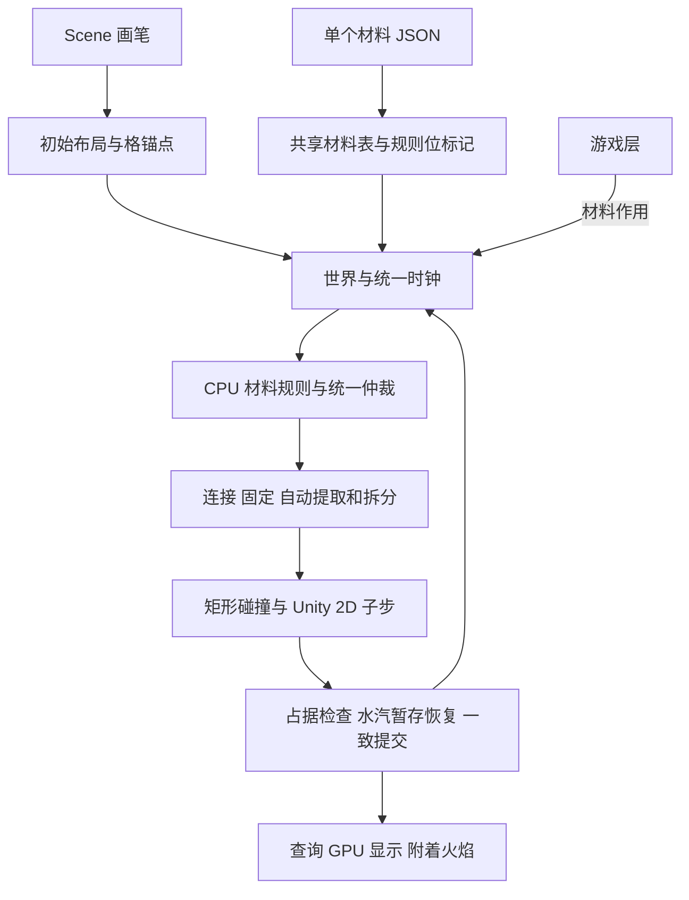

# OpenOita 技术选型

2026年10月6日水汽交互设计修订：本稿相关条款同步为公共合同1.10及[M06-F01](specs/M06-F01-水汽暂存与恢复.md)。暂存/恢复已通过本轮Editor功能验证，见[本轮记录](validation/M06-F01-实现与验证.md)；历史仓库核对、估时和测试记录不据此变成当前完成证据。JSON格式、默认值和性能阈值保持不变。

版本：0.10｜更新：2026年10月6日（北京时间）｜状态：已选首版技术基线，代码与实测待完成

OpenOita 采用 **CPU 像素材料模拟、自动结构识别、Unity 2D 刚体求解和 GPU 显示**。材料定义每格是什么，规则决定其行为，结构系统识别整体，刚体系统处理整体平移、旋转和碰撞；绘制场景不必预先登记木板或碎块。

本版把实现问题收束为技术选择及可调默认，可以据此开始实现。默认数值属于工程设计，不代表每项均经用户单独确认，也不代表已经实测。详细算法、接口、样例与验收步骤统一见[实现方案](<D:/work/Project/OpenOita/docs/OpenOita 初步实现方案 草案.md>)。

## 总体选型

| 技术部分 | 首版选择 | 作用与边界 |
| --- | --- | --- |
| 运行环境 | Unity 6000.3.11f1，Windows PC | 先在开发机建立可运行、可复现的独立包 |
| 材料模拟 | CPU 单线程；阶段快照、候选提案和稳定仲裁 | 扫描已分配区块与体内材料，不逐格分配规则对象 |
| 世界存储 | 区块字典＋块内连续数组；材料体局部网格 | 对外提供坐标到材料的映射，保留唯一所有权 |
| 材料配置 | 一个 materials.json；标签绑定内置 C# 规则 | JSON 加载一次，运行时查共享材料表与整数位标记 |
| 结构处理 | 四邻接、连接组与格锚点；全量连通检查 | 自动提取失固部分、再次拆分；单格碎片也保留 |
| 碰撞几何 | 局部格贪心矩形合并，每矩形一个 BoxCollider2D | 精确覆盖，不填孔、不简化单格细连接 |
| 刚体运动 | 专属 Unity 2D 物理场景，统一驱动与自适应子步 | 核心不直接依赖 Unity 物理 API，不自动接触默认场景角色 |
| 显示 | GPU 材料显示和附着火焰 | 仅消费已提交状态，帧末刷新，不做位姿插值 |
| 场景制作 | 自定义 Unity Scene 画笔 | 画、擦、固定标记、初燃标记、预览和初态保存加载 |
| 游戏接入 | 统一命令、只读查询和变化事件 | ECS 可作为玩法层，不是首版前置条件 |

Core/Data 管理定义与值类型，Simulation 管理权威材料、规则调度和事务，Structure 负责连通及锚定，PhysicsAdapter 管理求解器与几何，Render 负责显示，Editor 负责场景制作。

## 材料定义与规则绑定

| ID | 材料 | kind | tags |
| --- | --- | --- | --- |
| 101 | 水 | liquid | liquid_flow、extinguishes_fire |
| 102 | 混凝土 | solid | structure |
| 103 | 蒸汽 | gas | gas_drift |
| 104 | 木头 | solid | structure、burnable |

材料文件根为 `schemaVersion: 1`、`materialSetId: openoita-core-v1` 和 `materials`。`kind` 只表示分类，`tags` 显式启用规则；v1 中 solid 必须有 structure，liquid 必须有 liquid_flow，gas 必须有 gas_drift。不能只改 kind 就宣称支持了相应行为。

规则 ID 固定为 1 structure、2 liquid_flow、3 gas_drift、4 burnable、5 extinguishes_fire。加载时转换为 `ulong RuleMask`，位下标为 `RuleId-1`；共享运行表存参数，格子只存材料 ID 和自身动态状态。v1 只接受这些注册规则，未知配置键、未知标签、错配、重复 ID 和非法参数整份拒绝并报告字段；扩展位宽或新增规则必须同时更新代码和格式版本合同，不能静默丢弃。

新增使用已有规则的材料可以只改 JSON；新增行为需要实现并注册 C# 规则。JSON 数组或标签排列顺序不决定运行优先级。Tick 中不解析 JSON、不比较标签字符串、不使用反射逐格寻找规则，也不为格子复制标签集合。

完整样例：[materials.json](<D:/work/Project/OpenOita/docs/examples/materials.json>)；格式：[materials.schema.json](<D:/work/Project/OpenOita/docs/schemas/materials.schema.json>)。schema 用于格式校验，材料兼容、引用及资源预算仍由语义校验器检查。

## 各规则的首版默认

| 规则 | 默认行为 |
| --- | --- |
| structure | 同一归属中四邻接且 connectionGroup 相同就连接；混凝土、木头同属 building；对角不连 |
| liquid_flow | 水每2 Tick先尝试净向下原子链，再尝试普通下、斜下和有效横移，每实例最多一邻格；链内目标可为本链下一水源，末端须原空；开放槽摊平、平台向低处溢流、平衡后停止无效往返；不模拟压力、浮力 |
| gas_drift | 蒸汽每 3 Tick 尝试上、斜上、横向各一格，只进入空格；每 Tick 寿命减 1，默认 200 Tick 到 0 消散 |
| burnable | 木头默认 250 Tick 燃料，每燃烧 Tick 减 1；每 10 个燃烧更新 Tick 尝试点燃四面接触的可燃格 |
| extinguishes_fire | 与水接触优先阻止本步点燃、传播和烧损；灭火不消耗水，不生成蒸汽 |

水斜下及蒸汽左右平局按`(tick+x+y+seed)`奇偶选择；水的横向方向按[M03-L01](specs/M03-L01-液体扩散与液面平衡.md)依据可达低处选择，不能每步仅因奇偶反向。该补充对应公共合同1.7，原子链探针已通过、运行验收进行中，旧局部移动测试不覆盖液面平衡。阶段使用输入快照，冲突候选按固定键排序，只由调度器提交。多源争同一目标有唯一胜者，完整动态状态随搬运转移。水与蒸汽互相阻挡、不交换位置；同材原子水链按M03-L01整批迁移，不能提交半链；蒸汽由初始布局或Spawn产生，暂不加入蒸发、冷凝和自发热转化。

点燃通过 `Ignite` 命令或初态 `initialBurning`。新点燃格下一 Tick 才开始消耗和传播；熄灭仅清除 Burning，保留剩余燃料，可再次点燃。燃尽前材料 ID、完整格几何和单格质量不变，已耗比例用于烧损显示；燃尽时移除材料并统一更新结构、质量和碰撞。燃尽格不重生。无烟、灰及其视觉效果，不模拟氧气或耗氧。

火焰由已提交燃烧状态派生，不占材料格，无独立质量和碰撞。状态随提取、平移、旋转和拆分保留，显示跟随所属材料局部坐标；移除、替换、熄灭、燃尽或 Reset 时同步清理。只有状态变化也必须刷新显示。

## 数据与坐标

主网格逻辑上是 `<格坐标, 材料类型>` 映射：通过坐标读 `CellState.MaterialId`，再查共享材料定义；空格 ID 为 0，非空 ID 范围 1 至 65535。底层用 `Dictionary<ChunkCoord, WorldChunk>` 定位区块，块内 `NativeArray<CellState>` 连续存储；合法缺块查询返回空，不分配区块。

运行权威状态分为主网格、动态材料体和水汽暂存集合，另有派生表示。每份非空材料只归主网格、一个Body或一条暂存记录所有，数量及容量按三者合计；材料体存自己的局部格、BodyId、几何原点、连续位姿和速度。碰撞、世界占据及显示从权威材料派生，不能把旋转采样反复写回主网格。无显式生成、移除或消散时，搬运、提取及拆分前后材料量守恒。

默认世界为 256×256 格、区块 128×128 格、格长 `s=0.1`，X 向右、Y 向上。中心为 `O+s×(x+0.5,y+0.5)`，点转格向下取整，逻辑范围左闭右开。Host 保持零旋转、单位缩放，运行中原点不变；质心与几何原点分别保存。命中运动体时逆变换到局部，检查实际材料，不能把包围盒或孔洞当实体。

## 结构、几何与物理

初始化和材料增删替换后，全量检查连接与固定。固定约束绑定具体主网格结构格，固定区域展开为格锚点；删格或替换时删除对应锚点，后续 Spawn 不恢复旧锚点。仍可达任一有效锚点的结构保持固定，其他分量全部提取。动态体断开后全部分量独立运动；碰撞接触、跨 Body 接触不会自动焊接。

`MinRigidBodyCells=1`。所有非空分量都保留为刚体，包括单格碎片，不转为沙或散粒，不只保留最大块。资源不足则整次拒绝或停步，不丢弃材料。

几何采用固定 y/x 扫描的贪心矩形合并：先取未覆盖格的最大连续横段，再向上扩展等宽未覆盖行，每矩形对应 BoxCollider2D。形状精确覆盖材料占据，多矩形属于一个刚体，孔洞保持为空；静态网格按区块重建。选择该算法是为了先保证无简化误差，其形状数量、接缝和重建性能仍须实测。

质量按格质量相加，质心按格中心质量加权；惯量为每格自身正方形惯量 `m*s²/6` 加平行轴项，不以合并矩形的均匀密度代替异材质量。拆分保持材料世界位置，子体继承 `v子=v原+ω原×(c子−c原)` 及原角速度。保留同一 BodyId 的删格或燃尽若改变质心，也按 `v新=v旧+ω旧×(c新−c旧)` 更新质心线速度，保持剩余格的世界位置和原角速度。内部角速度用弧度/秒，Unity 适配层负责与度/秒双向转换。位置连续性、速度和质量误差预算见技术初案及实现方案，均待验证。

选择专属 Unity 2D 物理场景，由唯一驱动调用模拟。固定 Tick 默认 `h=0.02秒`，每 Tick 自适应 1 至 8 个子步；含重力的预测最大边缘位移每子步不超过 `s/2`。速度边界为线速度 5 世界单位/秒、角速度 180 度/秒；超速或 8 子步仍不能满足时 Faulted，不夹回、不删料、不静默更改速度。材料规则每 Tick 只执行一次，子步总时间为 h。材料刚体 `gravityScale=0`，适配层每子步施加一次 `mass*gravity` 的力，不修改全局 gravity，也不另行叠加重力速度。

## 跨归属接触与水汽暂存恢复

同一主网格或同一 Body 内，传播和灭火用四邻接。跨归属先用世界空间索引筛选，再计算实际格正方形 OBB 的最近特征距离；距离不超过 `1e-4*s` 的边—边、顶点—边接触有效，仅顶点—顶点相切不算。Unity contactOffset 或求解器接触记录不扩大规则邻域，几何间隙超阈值时不传播。正面积重叠也属于接触，但固体求解微穿透另按最大 `0.1*s` 的独立预算校验，超过则 Faulted，不能因任意微小重叠就判故障。包围盒只做候选筛选，不能隔着孔洞、空缺或墙壁传播。

水与蒸汽不向固体施加反作用力。每个物理子步按真实固体正面积覆盖收集活动水汽，整批清源并保存完整暂存记录，与候选位姿联合预检/采用；不要求即时空位。隐藏没有活动占据、接触或显示，新记录最早下一Tick恢复。全部子步后，旧记录优先原格，再按四邻接路径距离/y/x在fluidDisplacementRadius内选择最终固体外的活动空格，静态墙和边界不得穿越。完整规则见M06-F01。

没有合法恢复目标时保留记录、保持Ready并正常提交；可恢复的部分统一预检后整批恢复。真正暂存/恢复资源或内部故障仍Faulted，不丢材料、不发布失败Tick；Unity求解器已推进时不承诺回滚。暂存前湿接触保留，隐藏本身不接触，恢复新接水立即熄灭但不回滚本Tick已消耗燃料；暂存蒸汽每Tick寿命恰更新一次。

## 步进与一致性

每 Tick 按“执行命令 → 记录水接触 → 水移动 → 蒸汽寿命与移动 → 合并水接触并灭火 → 燃烧消耗与传播 → 结构与碰撞同步 → 物理子步、暂存、旧记录恢复及新接触灭火 → 校验发布 → 帧末显示”推进。本 Tick 湿接触集合只增加、不清退，水流走或被暂存不撤销已记录的抑制；物理后新接触不追溯撤销早前已完成的消耗。每个阶段使用快照、候选提案和稳定仲裁；完整细序以实现方案为准。

材料变化及其全部结构结果构成候选事务。所有材料、几何、质量、身份映射和资源准备成功后共同生效，旧碰撞在相关物理推进前撤销。外部命令预检失败整条拒绝；自动规则无法完成进入 Faulted。此前已一致提交的事务及物理求解不承诺整 Tick 回滚。

自动和手动驱动互斥；宿主时钟不匹配则暂停报告，不修改全局设置。步内禁止普通查询重入及生命周期重入；通知阶段允许查询已提交结果和排队下一步命令，递归 Step 或同步 Reset／Dispose 返回 Busy。订阅者异常不撤销已提交结果。

## 编辑保存与接口

Scene 画笔提供材料选择、画、擦、固定标记、初燃标记、预览、保存与重开；初燃工具只对可燃格设置或清除标记。保存文件只描述编辑初态：`schemaVersion`、`materialSetId`、`cells[{x,y,materialId}]`、`fixedCells`、`initialBurning`，不持久化运行 BodyId。材料集不匹配、引用无效材料、重复格和非法锚点时拒绝加载；改变材料 ID 含义不能静默迁移旧场景。

材料文件、世界参数和地图初态分别保存；Host 显式绑定资源，Player 不扫描源码目录。进入运行时建立副本，试玩破坏不回写编辑初态，Reset 恢复指定初态。样例为 [materials.json](<D:/work/Project/OpenOita/docs/examples/materials.json>)、[world_config.json](<D:/work/Project/OpenOita/docs/examples/world_config.json>)、[scene.json](<D:/work/Project/OpenOita/docs/examples/scene.json>)，对应 Schema 位于 [schemas](<D:/work/Project/OpenOita/docs/schemas>)。

| 接口 | 合同 |
| --- | --- |
| Create／Step／Reset／Dispose | 生命周期、固定时钟及故障恢复；Reset 增加 generation，Tick 归零 |
| Spawn／Remove／Replace／Ignite | 世界空间作用，路由到权威主网格或 Body 局部格；区域命令整体预检 |
| 点／区域／线段查询 | 按实际材料返回基础 ID、动态状态与归属；带 generation 和 committedTick |
| 变化事件 | 材料、几何、体创建销毁、旧新 BodyId 映射；只发布提交版本 |

区域选择采用实际格中心位于左闭右开的世界矩形内，预览与执行共用判据，不按格正方形相交选格。Spawn 按主网格格中心枚举候选，只写空位；任何目标已有材料或与动态固体正面积重叠，都返回 Occupied 并整条拒绝。Remove 遇空无变化；Replace 只替换已有材料、空格跳过，重置动态状态和旧锚点；动态体仅接受替换为 structure 固体，水汽返回 UnsupportedOperation。Ignite 作用于有剩余燃料的可燃格。

令牌绑定 generation 与单调序号。`Retry(token)` 只查询原请求状态或结果，不重新入队或执行；未知令牌返回 InvalidToken，结果淘汰后返回 ResultExpired，二者都不成为新请求。跨代次令牌失效，具体状态名称见实现方案。游戏不直接修改内部数组或刚体位姿。

## 能力与验证边界

工程容量默认：总材料格不超过 65536、动态体不超过 64、每体矩形不超过 256、静态与动态合计材料碰撞形状不超过 4096、每 Tick 变更格不超过 65536。世界边界用 4 个固定 BoxCollider2D 单独管理，不占 4096 个材料形状预算。容量超限不截断处理，外部命令拒绝、自动规则 Faulted；这些是拟定边界，须通过开发机测试后才可标记支持。

先以开发机建立性能基线，再确定最低配置。分别记录 JSON 加载、材料表与标签判断、邻域、规则更新、连通、几何、物理、索引、GPU 上传以及分配和内存峰值；稳态与大面积燃烧／集中破坏峰值分开统计。实现方案中的耗时预算是待测工程目标，不将未执行的探针写成性能保证。先保持全量扫描，无活跃队列或休眠优化；优化必须与正确性基线比较。

首版验收覆盖绘制保存、配置与包、跨块固定、多块脱落、动态编辑、守恒一致、生命周期故障、性能与真实游戏接入，以及四种材料和燃烧。详细 T1–T9 见实现方案。

首版不包含应力、弯曲、弹性、过载断裂、浮力、压力、复杂双向流体、相变、角色推挤、公开爆炸冲量接口、大世界优化、运行时画笔及高级绘制工具。若要加入，才需要另行决定需求范围。人员实际可用时间、接入与验收认领、可执行交付日期仍需团队落实；它们不由技术默认代替。
